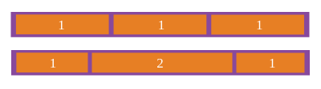
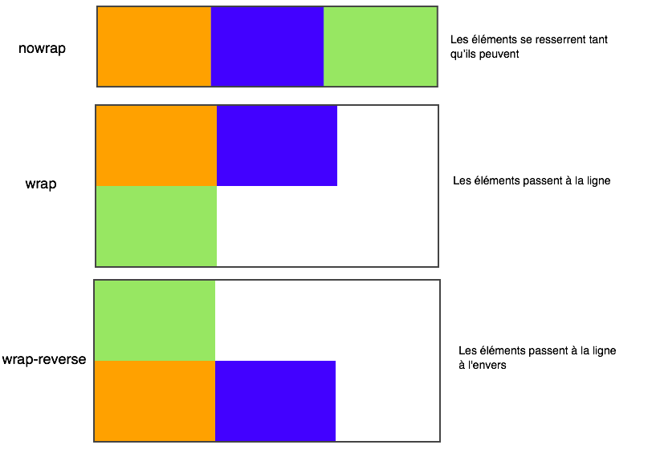
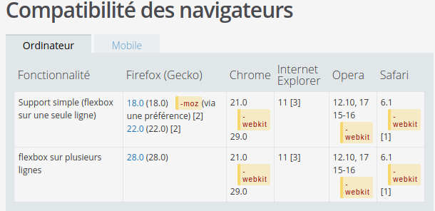

Petit wiki explicatif!

FlexBox:
--Mode de mise en page qui s'accomode à différentes tailles d'écran/appareils. Les éléments peuvent être placés dans n'importe quelle direction.(Date de création 2007)

--Flex est une propriété CSS qui s'applique sur un conteneur pour organiser son contenant.

--Display:flex met le contenant en ligne.

--flex container: L'élément parent dans lequelle chaque éléments sera contenu.  

--axes: Toutes les boites suivent deux axes: L'axe principale et l'axe secondaire.

--justify-content: Définit comment les éléments flex sont positionnés le long de l'axe.

--lines: Les éléments flex peuvent être positionnés soit sur une seul ligne, soit sur plusieurs via la propriété: "flex-wrap".

--Dimensions: Les termes désignant la hauteur et la largeur sont la taille principale (main size) et la taille secondaire (cross size).

--min-height:
              --ont une valeur initiale de auto.
--min-width:

--Déclarer une flexbox: --display: flex
                        --display: inline-flex

--Les propriétés des flexible box: --La propriété column: Aucun effet sur un élément flex.
                                   --La Propriété vertical-align: Aucun effet sur les éléments flex.
                                   --La propriété float et clear: Aucun effet sur les éléménts flex.

--Les sauts de pages sont possibles dans les affichages par flexible boxes via la propriété : break- .

--flex-grow: Indique le facteur de grossisement d'un élément flexible. Elle indique la quantité d'espace que l'élément devra consommer dans un conteneur flexible.
  
      
--flex-schrink: Indique le facteur de rétrécissement d'un élément flexible. (Valeur initiale:1)

--flex-basis: Détermine la base de flexibilité utilisée comme taille initiale principale pour un élément flexible. Cette propriété détermine la taille de la boite de contenu sauf si une autre boite est viséé par "box-sizing".

--box-sizing: Propriété utilisée pour modifier le modèle de boite CSSqui est utilisé pour calculer la largeur et la hauteur des éléments. Il est possible d'utiliser cette propriété pour émuler le comportement des navigateurs qui n'appliquent pas correctement la spécification du modèle de boite CSS.

--flex direction: Permet d'agencer les éléments dans le sens que l'on veut.
                  --row : Organisé sur une ligne.
                  --columnn : Organisé en colonne.
                  --row-reverse :Organisé sur une ligne en ordre inversé.
                  --column-reverse :Organisé sur colonne en ordre inversé.
  
--flex-wrap: Pemet le retour à la ligne des éléments.
                  --no-wrap: Pas de retour à la ligne.
                  --wrap: Les éléments vont à la ligne quand il n'y a plus de place.
                  --wrap-reverse: Les éléments vont à la ligne lorsqu'il n'y a plus de place.

compatibilité flexbox/navigateurs:  

